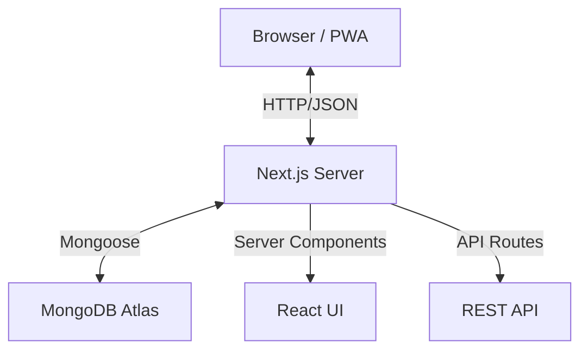

# Technical Specification: Careers Page Builder

## 1. Architecture Overview

The application follows a **Monolithic** architecture using **Next.js App Router**, which unifies the frontend and backend in a single deployable unit. This simplifies development, deployment, and type safety.

### High-Level Diagram

## 2. Core Components

### 2.1 Frontend
- **Framework**: Next.js 14+ (App Router)
- **UI Library**: Material-UI (MUI) v6+
- **Styling**: Emotion (CSS-in-JS)
- **State Management**: React Context + Local State (sufficient for this complexity)
- **Data Fetching**: Server Components (RSC) for initial load, `fetch` for client-side interactions

### 2.2 Backend
- **Runtime**: Node.js (via Next.js API Routes)
- **Database**: MongoDB (NoSQL)
- **ODM**: Mongoose
- **Authentication**: JWT (Stateless)

## 3. Data Models

### 3.1 Company
| Field | Type | Description |
|-------|------|-------------|
| `slug` | String | Unique identifier for URL (indexed) |
| `name` | String | Display name |
| `email` | String | Login email (unique) |
| `password` | String | Bcrypt hash |
| `theme` | Object | Custom colors and fonts |
| `content_sections` | Array | Dynamic page content (Hero, Text, etc.) |

### 3.2 Job
| Field | Type | Description |
|-------|------|-------------|
| `company_id` | ObjectId | Reference to Company |
| `title` | String | Job title |
| `job_slug` | String | URL-friendly title |
| `description` | String | Full job details (HTML/Markdown) |
| `location` | String | e.g., "Remote", "New York" |
| `isOpen` | Boolean | Status toggle |

## 4. API Design

### Authentication
- `POST /api/auth/signup`: Register new company
- `POST /api/auth/login`: Authenticate and issue JWT

### Company
- `GET /api/company/[slug]`: Public company data
- `PUT /api/company/update`: Update settings (Protected)

### Jobs
- `GET /api/jobs`: List jobs (Public/Private)
- `POST /api/jobs`: Create job (Protected)
- `PUT /api/jobs/[id]`: Update job (Protected)
- `DELETE /api/jobs/[id]`: Remove job (Protected)

## 5. Security Measures

- **JWT Authentication**: Tokens signed with HS256, stored in localStorage (MVP) or HTTP-only cookies (Production).
- **Password Hashing**: Bcrypt with 12 salt rounds.
- **Input Validation**: Mongoose schema validation + API route checks.
- **Route Protection**: Middleware-like checks in API routes using `verifyToken`.
- **Environment Variables**: Sensitive data (DB URI, JWT Secret) stored in `.env.local`.

## 6. Performance Optimization

- **Server Components**: Reduce client-side bundle size by rendering static content on the server.
- **Database Caching**: Mongoose connection caching to prevent cold start delays in serverless environment.
- **Dynamic Imports**: Used for heavy components if necessary.
- **Image Optimization**: Next.js `<Image>` component (planned).

## 7. Deployment Strategy

- **Platform**: Vercel (recommended) or any Node.js host.
- **Build Process**: `next build` generates optimized production build.
- **Environment**: Requires `MONGODB_URI`, `JWT_SECRET`, `NEXT_PUBLIC_APP_URL`.

## 8. Future Improvements

- **Candidate Accounts**: Allow candidates to save jobs and track applications.
- **Email Integration**: Send real emails via SendGrid/AWS SES instead of `mailto:`.
- **Analytics**: Track page views and application clicks.
- **Rich Text Editor**: Upgrade job description editor to support formatting.
- **File Uploads**: Allow uploading company logos to S3/Cloudinary instead of URL.
